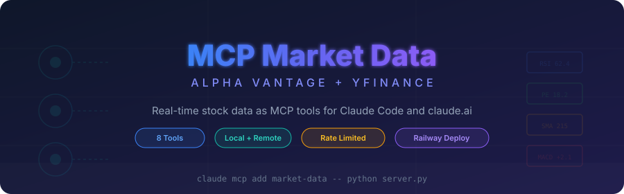

<div align="center">

<picture>
  <source media="(prefers-color-scheme: dark)" srcset="assets/hero-banner.svg"/>
  <source media="(prefers-color-scheme: light)" srcset="assets/hero-banner.svg"/>
  
</picture>

<br/>

[](https://modelcontextprotocol.io)
[](https://www.alphavantage.co)
[](https://railway.com)
[](#)

</div>

---

## What Is This?

An [MCP](https://modelcontextprotocol.io) server that provides **real-time stock market data** as tools that Claude can call directly. It wraps the [Alpha Vantage API](https://www.alphavantage.co) and [yfinance](https://github.com/ranaroussi/yfinance) into 8 clean tools that return structured JSON -- quotes, fundamentals, technical indicators, and news sentiment.

Works with:
- **Claude Code** (local, via stdio)
- **claude.ai** (remote, via Railway/Render deployment)
- **Any MCP-compatible client**

This server powers the [TradingAgents-CC](https://github.com/LeVarez/TradingAgents-CC) pipeline, but can be used standalone for any project that needs market data.

---

## Tools

| Tool | What It Returns | API Calls | Time |
|---|---|---|---|
| `get_quote(ticker)` | Current price, volume, change, previous close | 1 | ~13s |
| `get_overview(ticker)` | PE, EPS, margins, market cap, analyst ratings, 52-week range | 1 | ~13s |
| `get_rsi(ticker, period)` | RSI indicator (default 14-day) | 1 | ~13s |
| `get_sma(ticker, period)` | Simple Moving Average (default 50, also 200) | 1 | ~13s |
| `get_macd(ticker)` | MACD line, signal line, histogram | 1 | ~13s |
| `get_full(ticker)` | **All of the above in one call** -- price, PE, EPS, margins, RSI, SMA 50/200, MACD, analyst ratings | 6 | ~75s |
| `get_news(ticker)` | Up to 15 articles with sentiment scores (-1 to 1) | 1 | ~13s |
| `get_news_general()` | Up to 30 broad market articles with mentioned tickers | 1 | ~13s |

> Each tool returns structured JSON. Times include rate limiting pauses (Alpha Vantage free tier: 5 calls/minute).

---

## Installation

### Prerequisites

- **Python 3.10+**
- **Alpha Vantage API key** -- [get a free key here](https://www.alphavantage.co/support/#api-key) (25 calls/day, 5 calls/minute)

### Install

```bash
git clone https://github.com/LeVarez/mcp_server.git
cd mcp_server
pip install -r requirements.txt
```

### Set Your API Key

```bash
export ALPHA_VANTAGE_API_KEY=your_key_here
```

---

## Usage

### Option 1: Local with Claude Code (stdio)

Register the server with your Claude Code project:

```bash
claude mcp add market-data \
  -e ALPHA_VANTAGE_API_KEY=your_key_here \
  -- python /path/to/mcp_server/server.py
```

Claude Code will automatically start the server when needed. You can then ask Claude things like:

```
> Get me the full analysis for NVDA
> What's the RSI for AAPL?
> Show me market news sentiment
```

To run the server manually (useful for testing):

```bash
python server.py
```

### Option 2: Remote with claude.ai (Railway)

Deploy to Railway for remote access from claude.ai scheduled tasks and conversations.

#### Deploy

1. **Fork** this repo or push it to your GitHub
2. Go to [railway.com](https://railway.com) → **New Project** → **Deploy from GitHub**
3. Set the environment variable:
   - `ALPHA_VANTAGE_API_KEY` = your key
4. Railway deploys automatically and gives you a URL like `https://mcp-server-xyz.up.railway.app`

The included `railway.toml` and `Procfile` handle the configuration:

```toml
# railway.toml
[deploy]
startCommand = "python server.py --remote"
healthcheckPath = "/health"
```

#### Connect to claude.ai

1. Go to **claude.ai** → **Settings** → **Connectors** → **Add custom connector**
2. Paste your Railway URL: `https://your-app.up.railway.app/mcp`
3. Done -- Claude can now call market data tools in any conversation

#### Verify Deployment

Hit the health endpoint:

```bash
curl https://your-app.up.railway.app/health
# {"status": "ok", "server": "market-data"}
```

### Option 3: Remote via HTTP (self-hosted)

Run as an HTTP server on any machine:

```bash
python server.py --remote
# or
MCP_TRANSPORT=streamable-http python server.py
```

This starts a Uvicorn server on port 8000 (or `$PORT`) with the MCP endpoint at `/mcp` and a health check at `/health`.

---

## API Rate Limits

Alpha Vantage free tier has strict limits:

| Limit | Value |
|---|---|
| Calls per minute | 5 |
| Calls per day | 25 |
| Pause between calls | ~12.5 seconds (handled automatically) |

### Budget Planning

| Operation | API Calls |
|---|---|
| `get_full()` for 1 ticker | 6 |
| `get_full()` + `get_news()` for 1 ticker | 7 |
| Full 3-ticker pipeline run | ~22 |
| Full 4-ticker pipeline run | ~29 (exceeds free tier) |

The server handles rate limiting automatically -- it pauses between calls to stay within the 5 calls/minute limit. If you hit a rate limit response, it waits 15 seconds and retries.

For higher limits, upgrade at [alphavantage.co/premium](https://www.alphavantage.co/premium/).

---

## Configuration

| Environment Variable | Default | Description |
|---|---|---|
| `ALPHA_VANTAGE_API_KEY` | *(none)* | Your Alpha Vantage API key |
| `MCP_TRANSPORT` | `stdio` | Transport mode: `stdio` or `streamable-http` |
| `PORT` | `8000` | HTTP port (only for remote mode) |

The `--remote` flag is shorthand for `MCP_TRANSPORT=streamable-http`.

---

## Example Responses

### `get_quote("NVDA")`

```json
{
  "ticker": "NVDA",
  "price": "215.20",
  "change": "+3.45",
  "change_percent": "+1.63%",
  "volume": "45230100",
  "previous_close": "211.75"
}
```

### `get_overview("NVDA")`

```json
{
  "ticker": "NVDA",
  "name": "NVIDIA Corporation",
  "pe_ratio": "42.3",
  "eps": "5.09",
  "market_cap": "5280000000000",
  "profit_margin": "0.553",
  "analyst_target": "250.00",
  "analyst_rating": "Strong Buy",
  "52_week_high": "240.50",
  "52_week_low": "85.62"
}
```

### `get_full("NVDA")`

Returns all of the above plus RSI, SMA 50, SMA 200, and MACD in a single JSON object. Takes ~75 seconds due to rate limiting.

---

## Project Structure

```
mcp_server/
  server.py          # MCP server with all tool definitions
  requirements.txt   # Python dependencies (mcp, uvicorn, starlette)
  Procfile           # Railway process command
  railway.toml       # Railway deployment config
  assets/
    hero-banner.svg  # README banner
```

---

## Used By

- **[TradingAgents-CC](https://github.com/LeVarez/TradingAgents-CC)** -- Multi-agent trading analysis pipeline for Claude Code

---

## Contributing

1. **Fork** the repo
2. **Create a branch**: `git checkout -b feature/new-tool`
3. **Add your tool** in `server.py` using the `@mcp.tool()` decorator
4. **Test locally**: `python server.py` and call the tool via Claude Code
5. **Push** and open a **Pull Request**

### Adding a New Tool

```python
@mcp.tool()
def get_my_data(ticker: str) -> str:
    """One-line description shown to Claude.

    Detailed explanation of what this tool returns and when to use it.
    """
    data = _fetch({"function": "YOUR_FUNCTION", "symbol": ticker.upper()})
    # Process and return JSON
    return json.dumps({"ticker": ticker.upper(), "result": data}, indent=2)
```

The `_fetch()` helper handles rate limiting and error handling automatically.

---

<div align="center">

<sub>Built for the terminal. Powered by Alpha Vantage.</sub>

</div>
